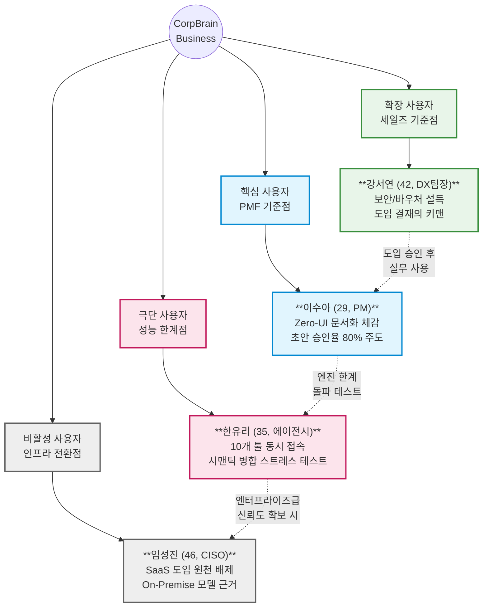
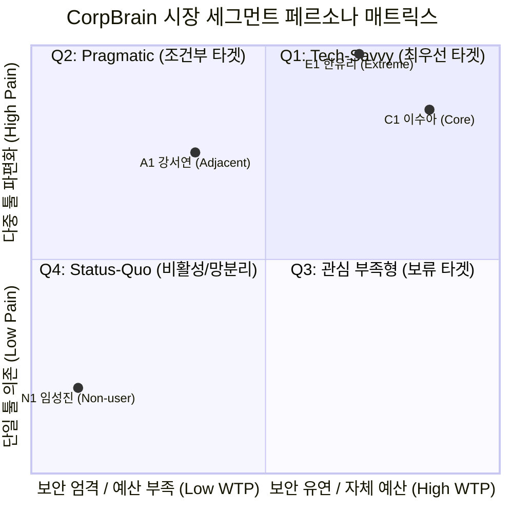
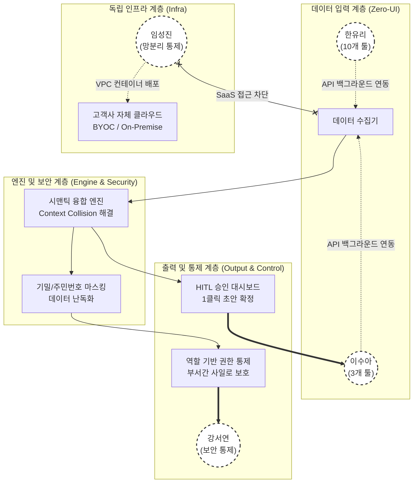
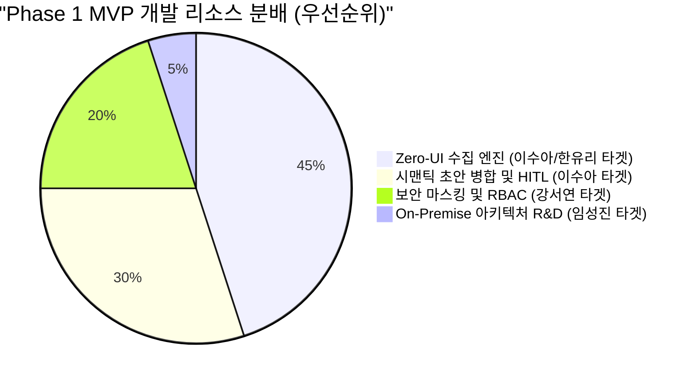

# **CorpBrain Persona Spectrum Map (페르소나 시각화 맵)**

지금까지 도출된 고객 페르소나(이수아, 강서연, 한유리, 임성진) 간의 관계와 시장 내 위치, 제품과의 접점을 명확히 구조화하기 위해 **5가지 관점의 시각화 맵(Mermaid)**을 구성했습니다.

---

## **Map 1. 스펙트럼 전체 구조 (Spectrum Overall Structure)**
각 페르소나가 CorpBrain 비즈니스 내에서 어떤 역할을 담당하며 어떻게 상호작용하는지를 보여주는 전체 구조도입니다.

---

## **Map 2. 시장 세그먼트 매트릭스 (Market Segment Quadrant)**
TAM-SAM-SOM 산출 시 정의했던 '파편화 고통'과 '결제 의향/보안 유연성'을 축으로 4명의 페르소나 위치를 맵핑했습니다.

- **해석:** 이수아(우상단)가 가장 이상적인 수익원이지만, 실제 B2B 시장의 파이를 키우려면 예산/보안 장벽에 막혀있는 강서연(좌상단)을 Q1 영역으로 끌어와야(마스킹, 바우처 등) 합니다. 임성진은 현재의 SaaS 모델로는 절대 도달할 수 없는 좌하단에 위치합니다.

---

## **Map 3. 전환 및 바이럴 흐름도 (B2B Sales & Viral Flow)**
실제 기업에 CorpBrain 솔루션이 안착하고 확장되는 과정에서 각 페르소나가 어떤 흐름으로 엮이는지 보여줍니다.

```mermaid
graph LR
    classDef sales fill:#FFF3E0,stroke:#F57C00,stroke-width:2px
    classDef product fill:#E3F2FD,stroke:#1976D2,stroke-width:2px
    classDef expansion fill:#F3E5F5,stroke:#7B1FA2,stroke-width:2px

    Start(영업/마케팅 시작) --> SalesDeck["보안 아키텍처 및<br>ROI 절감 리포트 제시"]:::sales
    SalesDeck --> A1["**강서연 (도입 검토)**<br>경영진 설득 및 바우처 확보"]:::sales
    A1 -- 사내망 도입 승인 --> C1["**이수아 (실무 적용)**<br>노션 수동 문서화 중단"]:::product
    C1 -- 무수정 승인 80% 달성 --> Viral["사내 타 부서로 바이럴<br>엔진 신뢰도 획득"]:::product
    
    Viral --> E1["**한유리 (극한 환경)**<br>고도화된 다중 툴 연동"]:::expansion
    E1 -- 극단적 병합 성공 --> Ent["엔터프라이즈급 성능 완성"]:::expansion
    Ent -.-> N1["**임성진 (규제 시장)**<br>On-Premise 패키지 제안"]:::expansion
```

---

## **Map 4. 플랫폼 접점 모델 (Platform Touchpoint Model)**
페르소나들이 CorpBrain 제품의 **어떤 계층(Layer)의 피처(Feature)**와 직접적으로 상호작용하는지 아키텍처 관점에서 시각화했습니다.

---

## **Map 5. 제품 설계 우선순위 (Product Design Priority)**
MVP(최소 기능 제품) 개발 시 리소스를 어디에 집중해야 하는지, 페르소나별 비중을 나타냅니다.

### **우선순위 해석:**
1. **45% (Zero-UI 엔진):** 사용자가 직접 입력하는 마찰을 없애는 것이 핵심이자, E1(한유리)의 극한 환경까지 버텨야 하므로 가장 많은 엔지니어링 리소스가 투입됩니다.
2. **30% (HITL 및 병합):** 이수아(C1)가 심리적 통제감을 느끼며 초안을 승인할 수 있는 대시보드 개발에 집중합니다.
3. **20% (보안 및 마스킹):** 강서연(A1)을 설득하기 위한 최소한의 B2B 세일즈 무기(Table Stakes)를 구축합니다.
4. **5% (On-Premise 준비):** 당장 개발하지는 않으나, 임성진(N1)의 요구사항을 아키텍처 초기 설계(모듈화 등)에 반영해 두어 훗날 기술 부채를 방지합니다.
