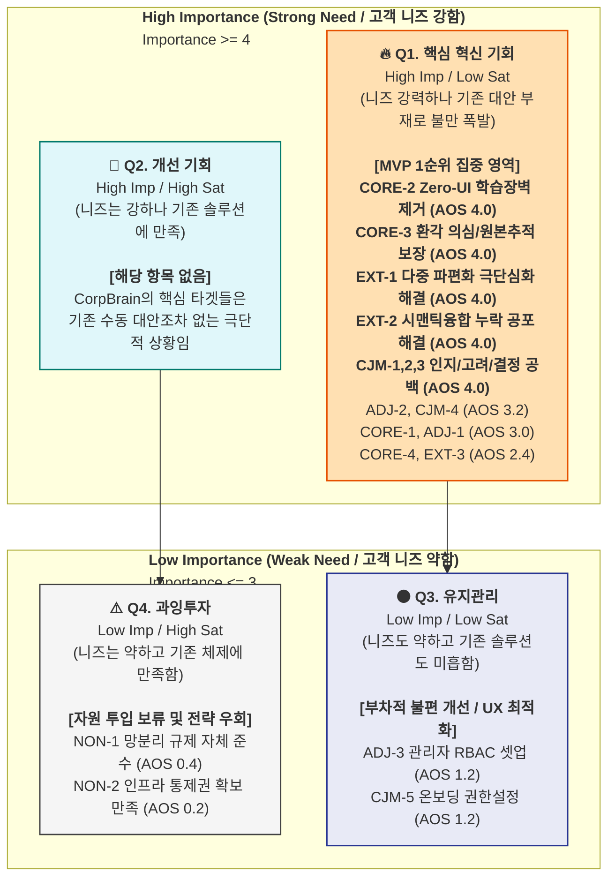

# AOS (Area of Opportunity Score) 산출 결과 — CorpBrain

본 문서는 앞서 평가한 **Importance(중요도)**와 **Satisfaction(만족도)** 데이터를 기반으로, CorpBrain이 시장에서 가장 먼저 선점해야 할 혁신 기회 영역(AOS)을 정량적으로 산출한 결과입니다.

**계산식:** `AOS = Importance × (1 - Satisfaction / 5)`

---

## **A. AOS 계산 결과 — 전체 항목**

### **🔵 핵심 (Core)**

| # | Pain / Goal | Imp | Sat | 1−Sat/5 | **AOS** |
| --- | --- | --- | --- | --- | --- |
| CORE-2 | 새로운 툴 학습 심리적 장벽 (Zero-UI) | 5 | 1 | 0.80 | **4.00** |
| CORE-3 | AI 환각 의심 및 원본 추적 | 5 | 1 | 0.80 | **4.00** |
| CORE-1 | 이기종 툴 수동 문서화 과부하 | 5 | 2 | 0.60 | **3.00** |
| CORE-4 | 동일 이슈의 맥락 단절 (Context Collision) | 4 | 2 | 0.60 | **2.40** |

### **🟢 확장 (Adjacent)**

| # | Pain / Goal | Imp | Sat | 1−Sat/5 | **AOS** |
| --- | --- | --- | --- | --- | --- |
| ADJ-2 | 정량적 도입 명분(ROI) 증명 부족 | 4 | 1 | 0.80 | **3.20** |
| ADJ-1 | 경영진 기밀 유출 우려 (보안) | 5 | 2 | 0.60 | **3.00** |
| ADJ-3 | 관리자 세팅(RBAC) 복잡성 | 3 | 3 | 0.40 | **1.20** |

### **🔴 극단 (Extreme)**

| # | Pain / Goal | Imp | Sat | 1−Sat/5 | **AOS** |
| --- | --- | --- | --- | --- | --- |
| EXT-1 | 10개 채널 파편화 극단 심화 | 5 | 1 | 0.80 | **4.00** |
| EXT-2 | 시맨틱 융합 오류 및 누락 공포 | 5 | 1 | 0.80 | **4.00** |
| EXT-3 | 엣지 케이스 처리 오류 교정 마찰 | 4 | 2 | 0.60 | **2.40** |

### **⚫ 비활성 (Non-user)**

| # | Pain / Goal | Imp | Sat | 1−Sat/5 | **AOS** |
| --- | --- | --- | --- | --- | --- |
| NON-1 | 클라우드 반출 불가 (망분리 규제) | 2 | 4 | 0.20 | **0.40** |
| NON-2 | 서드파티 의존성 및 통제권 상실 우려 | 1 | 4 | 0.20 | **0.20** |

### **CJM 여정 단계별 공통 Pain**

| # | Pain / Goal | Imp | Sat | 1−Sat/5 | **AOS** |
| --- | --- | --- | --- | --- | --- |
| CJM-1 | [인지/고려] 외부 AI 연동 정보 유출 우려 | 5 | 1 | 0.80 | **4.00** |
| CJM-2 | [고려] UI 변화 저항 및 워크플로우 붕괴 우려 | 5 | 1 | 0.80 | **4.00** |
| CJM-3 | [결정] AI 환각 의심 및 누락 공포 | 5 | 1 | 0.80 | **4.00** |
| CJM-4 | [결정] 정량적 ROI 명분 부족 | 4 | 1 | 0.80 | **3.20** |
| CJM-5 | [온보딩] 관리자 권한 세팅 복잡성 | 3 | 3 | 0.40 | **1.20** |

---

## **B. AOS 내림차순 종합 순위**

| 순위 | Pain ID | Pain 내용 | 분류 | Imp | Sat | **AOS** | 사분면 |
| --- | --- | --- | --- | --- | --- | --- | --- |
| **1** | CORE-2 | 새로운 툴 학습 심리적 장벽 (Zero-UI) | 🔵 핵심 | 5 | 1 | **4.00** | 🔥 Q1 혁신기회 |
| **1** | CORE-3 | AI 환각 의심 및 원본 추적 | 🔵 핵심 | 5 | 1 | **4.00** | 🔥 Q1 혁신기회 |
| **1** | EXT-1 | 10개 채널 파편화 극단 심화 | 🔴 극단 | 5 | 1 | **4.00** | 🔥 Q1 혁신기회 |
| **1** | EXT-2 | 시맨틱 융합 오류 및 누락 공포 | 🔴 극단 | 5 | 1 | **4.00** | 🔥 Q1 혁신기회 |
| **1** | CJM-1 | [인지/고려] 외부 AI 연동 정보 유출 우려 | CJM | 5 | 1 | **4.00** | 🔥 Q1 혁신기회 |
| **1** | CJM-2 | [고려] UI 변화 저항 및 워크플로우 붕괴 우려 | CJM | 5 | 1 | **4.00** | 🔥 Q1 혁신기회 |
| **1** | CJM-3 | [결정] AI 환각 의심 및 누락 공포 | CJM | 5 | 1 | **4.00** | 🔥 Q1 혁신기회 |
| **8** | ADJ-2 | 정량적 도입 명분(ROI) 증명 부족 | 🟢 확장 | 4 | 1 | **3.20** | 🔥 Q1 혁신기회 |
| **8** | CJM-4 | [결정] 정량적 ROI 명분 부족 | CJM | 4 | 1 | **3.20** | 🔥 Q1 혁신기회 |
| **10** | CORE-1 | 이기종 툴 수동 문서화 과부하 | 🔵 핵심 | 5 | 2 | **3.00** | 🔥 Q1 혁신기회 |
| **10** | ADJ-1 | 경영진 기밀 유출 우려 (보안) | 🟢 확장 | 5 | 2 | **3.00** | 🔥 Q1 혁신기회 |
| **12** | CORE-4 | 동일 이슈의 맥락 단절 (Context Collision) | 🔵 핵심 | 4 | 2 | **2.40** | 🔥 Q1 혁신기회 |
| **12** | EXT-3 | 엣지 케이스 처리 오류 교정 마찰 | 🔴 극단 | 4 | 2 | **2.40** | 🔥 Q1 혁신기회 |
| **14** | ADJ-3 | 관리자 세팅(RBAC) 복잡성 | 🟢 확장 | 3 | 3 | **1.20** | ⚫ Q3 유지관리 |
| **14** | CJM-5 | [온보딩] 관리자 권한 세팅 복잡성 | CJM | 3 | 3 | **1.20** | ⚫ Q3 유지관리 |
| **16** | NON-1 | 클라우드 반출 불가 (망분리 규제) | ⚫ 비활성 | 2 | 4 | **0.40** | ⚠️ Q4 과잉투자 |
| **17** | NON-2 | 서드파티 의존성 및 통제권 상실 우려 | ⚫ 비활성 | 1 | 4 | **0.20** | ⚠️ Q4 과잉투자 |

---

## **C. AOS 기회 매트릭스 시각화**

### **AOS 사분면 매트릭스**



---

## **D. 사분면별 전략 해석**

| 사분면 | 조건 | 항목 수 | 배치된 Pain (AOS 내림차순) | 전략 행동 |
| --- | --- | --- | --- | --- |
| 🔥 **Q1 혁신기회** | High Imp + Low Sat | **13개 (76%)** | **AOS 4.0:** CORE-2, CORE-3, EXT-1, EXT-2, CJM-1, CJM-2, CJM-3 <br> **AOS 3.2:** ADJ-2, CJM-4 <br> **AOS 3.0:** CORE-1, ADJ-1 <br> **AOS 2.4:** CORE-4, EXT-3 | MVP 실험 1순위. 핵심·확장·극단 분류의 Pain이 모두 집중됨. |
| 💎 **Q2 개선기회** | High Imp + Mid Sat | **0개 (0%)** | 없음 | 타겟 시장의 페인 포인트가 얼마나 '무대책' 상태인지 증명. |
| ⚫ **Q3 유지관리** | Mid Imp + Low Sat | **2개 (12%)** | **AOS 1.2:** ADJ-3, CJM-5 | 관리자 편의성(UX 최적화) 수준. Phase 2 이후 대응. |
| ⚠️ **Q4 과잉투자** | Low Imp + High Sat | **2개 (12%)** | **AOS 0.4:** NON-1 <br> **AOS 0.2:** NON-2 | N1 비활성(망분리) 영역. 직접 투자 보류, SaaS 고도화 이후 On-Premise로 장기 로드맵 분리. |

### **🔥 Q1 혁신기회 Top 5 — MVP 타게팅 1순위**

| 순위 | Pain | AOS | 해결 기능 | 분류 |
| --- | --- | --- | --- | --- |
| **1** | UI 변화 저항 및 워크플로우 붕괴 우려 | 4.00 | 백그라운드 구동 **Zero-UI** 캡처/API 엔진 | 🔵 핵심 |
| **2** | AI 환각 의심 및 원본 추적 | 4.00 | **100% 원본 딥링크 매핑** 및 Fact-Check UI | 🔵 핵심 |
| **3** | 다중 파편화 극단 심화 및 오류 공포 | 4.00 | **10개 이상 다중 채널 동시 융합(시맨틱 병합) 안정성** | 🔴 극단 |
| **4** | 외부 AI 연동 정보 유출 우려 (보안) | 4.00 | **기밀 마스킹 파이프라인** 및 보안 인증 노출 | 🟢 확장 |
| **5** | 정량적 도입 명분(ROI) 증명 부족 | 3.20 | 결재를 위한 **자동화 ROI 시뮬레이터 대시보드** | 🟢 확장 |

---

## **E. AOS 분포 요약**

```
전체 17개 항목 AOS 분포
━━━━━━━━━━━━━━━━━━━━━━━━━━━━━━
  4.00: ███████ 7개 (41%)  ← 최고 혁신기회 (Zero-UI, 딥링크, 보안, 극단안정성)
  3.20: ██      2개 (12%)  ← 강한 혁신기회 (ROI 명분)
  3.00: ██      2개 (12%)  ← 강한 혁신기회 (단가/자동화, 보안기안)
  2.40: ██      2개 (12%)  ← 혁신기회 하단 (맥락단절, 엣지케이스)
  1.20: ██      2개 (12%)  ← 유지관리 (RBAC)
  0.40: █       1개 ( 6%)  ← 과잉투자 (규제)
  0.20: █       1개 ( 6%)  ← 과잉투자 (통제권)
━━━━━━━━━━━━━━━━━━━━━━━━━━━━━━
  AOS 평균: 2.82 | 중앙값: 3.00
```

**핵심 인사이트:** 17개 항목 중 무려 13개(76%)가 Q1 혁신기회에 집중되어 있으며, **Q2(개선기회)가 단 하나도 존재하지 않습니다.** 이는 타겟들이 기존 방식(수동)으로도 만족하지 못해 "차선책조차 없는 완전한 시장 공백" 상태임을 시사합니다. 따라서 AOS 4.0을 기록한 `Zero-UI`, `원본 딥링크`, `극한 다중채널 안정성`, `엔터프라이즈 보안` 4가지 기둥이 MVP 개발의 모든 리소스를 투입해야 할 유일한 타겟입니다.
