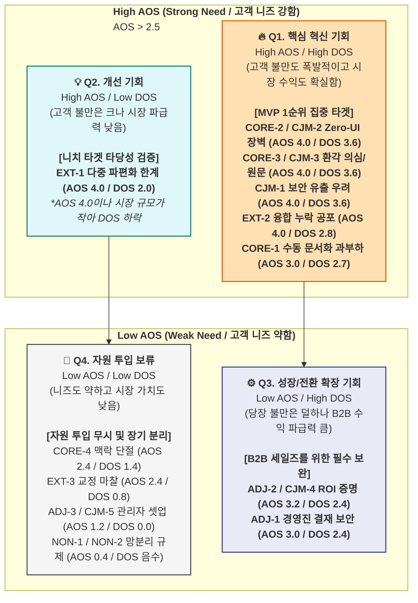

# DOS (Degree of Satisfaction Opportunity Score) 산출 결과 — CorpBrain

본 문서는 AOS(고객 미충족 강도)에 **Market Relevance(시장 타당성)**를 결합하여, 실제 비즈니스 관점에서 가장 수익성과 파급력이 높은 **최우선 혁신 기회(DOS)**를 도출한 최종 평가 결과입니다.

**계산식:** `DOS = (Importance - Satisfaction) × Market Relevance`

---

## **A. Market Relevance 평가 기준**

> Market Relevance(0.1~1.0)는 해당 Pain이 **TAM-SAM-SOM에서 갖는 비중**과 **시장 성장률·B2B 채택 파급력**을 종합 평가한 수치입니다.

| 시장 데이터 및 타겟 | 수치 적용 | 판단 근거 |
| --- | --- | --- |
| **🔵 C1 이수아 (PM/실무자)** | **0.9** | **SOM 수익 엔진 (Primary).** 실질적인 프로덕트 사용자로 PMF 달성을 위한 최우선 타겟. |
| **🟢 A1 강서연 (DX팀장)** | **0.8** | **B2B 결재자 (SAM).** 실무진이 원해도 A1을 통과하지 못하면 매출(라이선스 갱신) 발생 불가. |
| **🔴 E1 한유리 (에이전시)** | **0.5 ~ 0.7** | 파워 유저. 기술 한계를 테스트하는 주요 지표이나, 극한 환경 유저 자체의 시장 볼륨(TAM)은 작음. |
| **⚫ N1 임성진 (CISO/망분리)** | **0.1 ~ 0.2** | 시장 볼륨은 막대하나 현재 SaaS 모델로는 직접 전환 불가. 미래(On-Premise) 잠재 시장으로 취급. |

---

## **B. DOS 계산 — 전체 항목**

### **🔵 핵심 (Core)**

| # | Pain / Goal | Imp | Sat | MR | MR 근거 | **DOS** |
| --- | --- | --- | --- | --- | --- | --- |
| CORE-2 | 새로운 툴 학습 심리적 장벽 (Zero-UI) | 5 | 1 | **0.9** | SOM 수익 엔진의 초기 온보딩 필수 조건 | **3.60** |
| CORE-3 | AI 환각 의심 및 원본 추적 | 5 | 1 | **0.9** | C1 지속 사용 및 신뢰 유지의 핵심 기반 | **3.60** |
| CORE-1 | 이기종 툴 수동 문서화 과부하 | 5 | 2 | **0.9** | 제품의 본질적 가치(시간 단축)와 직결 | **2.70** |
| CORE-4 | 동일 이슈의 맥락 단절 | 4 | 2 | **0.7** | 부차적 비효율이나 제품의 핵심 수익원과는 약간 거리가 있음 | **1.40** |

### **🟢 확장 (Adjacent)**

| # | Pain / Goal | Imp | Sat | MR | MR 근거 | **DOS** |
| --- | --- | --- | --- | --- | --- | --- |
| ADJ-1 | 경영진 기밀 유출 우려 (보안) | 5 | 2 | **0.8** | B2B 엔터프라이즈 확장을 위한 1차 관문(결재 허들) | **2.40** |
| ADJ-2 | 정량적 도입 명분(ROI) 증명 부족 | 4 | 1 | **0.8** | 라이선스 전사 확장 및 차년도 갱신에 직접 영향 | **2.40** |
| ADJ-3 | 관리자 세팅(RBAC) 복잡성 | 3 | 3 | **0.6** | 온보딩 마찰이나 전담 인력(CSM)으로 단기 우회 가능 | **0.00** |

### **🔴 극단 (Extreme)**

| # | Pain / Goal | Imp | Sat | MR | MR 근거 | **DOS** |
| --- | --- | --- | --- | --- | --- | --- |
| EXT-2 | 시맨틱 융합 오류 및 누락 공포 | 5 | 1 | **0.7** | AI 엔진 신뢰성 하한선. B2B 전반의 신뢰 파급력이 큼 | **2.80** |
| EXT-1 | 10개 채널 파편화 극단 심화 | 5 | 1 | **0.5** | 에이전시 특수 환경. 기술적 중요성은 높으나 절대 시장 볼륨이 작음 | **2.00** |
| EXT-3 | 엣지 케이스 오류 교정 마찰 | 4 | 2 | **0.4** | 피로도 상승 요인이나 기능 사용 자체가 불가능한 것은 아님 | **0.80** |

### **⚫ 비활성 (Non-user)**

| # | Pain / Goal | Imp | Sat | MR | MR 근거 | **DOS** |
| --- | --- | --- | --- | --- | --- | --- |
| NON-1 | 클라우드 반출 불가 (규제) | 2 | 4 | **0.2** | 망분리 시장은 막대하나 SaaS MVP 단계에서 수익 기여도 0 | **-0.40** |
| NON-2 | 서드파티 통제권 상실 우려 | 1 | 4 | **0.1** | 기존 On-Premise 인프라에 이미 완벽히 만족 중 | **-0.30** |

### **CJM 여정 단계별 공통 Pain**

| # | Pain / Goal | Imp | Sat | MR | MR 근거 | **DOS** |
| --- | --- | --- | --- | --- | --- | --- |
| CJM-1 | [인지/고려] 외부 AI 연동 정보 유출 | 5 | 1 | **0.9** | B2B 퍼널 최상단의 진입 장벽 (마스킹 필수) | **3.60** |
| CJM-2 | [고려] UI 변화 저항/워크플로우 붕괴 | 5 | 1 | **0.9** | 온보딩 과정의 이탈 방지 핵심 (Zero-UI) | **3.60** |
| CJM-3 | [결정] AI 환각 의심 및 누락 공포 | 5 | 1 | **0.9** | 최종 도입 결정의 핵심 신뢰 자본 (딥링크) | **3.60** |
| CJM-4 | [결정] 정량적 ROI 명분 부족 | 4 | 1 | **0.8** | 세일즈 전환율을 지배하는 B2B 결재 논리 | **2.40** |
| CJM-5 | [온보딩] 관리자 권한 세팅 복잡성 | 3 | 3 | **0.6** | 운영의 비효율 수준 | **0.00** |

---

## **C. DOS 내림차순 종합 순위**

| 순위 | Pain ID | Pain 내용 | 분류 | AOS | **DOS** | 기회 해석 (Insight) |
| --- | --- | --- | --- | --- | --- | --- |
| **1** | CORE-2 | 새로운 툴 학습 심리적 장벽 (Zero-UI) | 🔵 핵심 | 4.00 | **3.60** | 도입부 가장 큰 마찰. "보이지 않는 백그라운드 AI"가 PMF의 최우선 과제 |
| **1** | CORE-3 | AI 환각 의심 및 원본 추적 | 🔵 핵심 | 4.00 | **3.60** | 결과물에 대한 신뢰 보장. 환각 발생 시 "원본 딥링크"가 유일한 방어기제 |
| **1** | CJM-1 | [인지/고려] 외부 AI 연동 정보 유출 | CJM | 4.00 | **3.60** | 마스킹 아키텍처를 전면에 내세워야 엔터프라이즈 세일즈가 시작됨 |
| **1** | CJM-2 | [고려] UI 변화 저항/워크플로우 붕괴 | CJM | 4.00 | **3.60** | (CORE-2와 동일 맥락) 기존 툴(슬랙, 지라)에서 벗어나지 않게 하는 전략 |
| **1** | CJM-3 | [결정] AI 환각 의심 및 누락 공포 | CJM | 4.00 | **3.60** | (CORE-3과 동일 맥락) 데이터 신뢰 구조화의 결정적 요인 |
| **6** | EXT-2 | 시맨틱 융합 오류 및 누락 공포 | 🔴 극단 | 4.00 | **2.80** | 엔진의 안정성 하한선. B2B 시장 전반에 퍼진 AI 불신을 종식시킬 기술력 증명 |
| **7** | CORE-1 | 이기종 툴 수동 문서화 과부하 | 🔵 핵심 | 3.00 | **2.70** | "퇴근 시간 단축"이라는 프로덕트의 본질적 가치. 타겟층의 핵심 소구점 |
| **8** | ADJ-1 | 경영진 기밀 유출 우려 (보안) | 🟢 확장 | 3.00 | **2.40** | B2B 도입의 핵심 결재 허들 돌파 (엔터프라이즈 보안 인증 체계 구비) |
| **8** | ADJ-2 | 정량적 도입 명분(ROI) 증명 부족 | 🟢 확장 | 3.20 | **2.40** | 자동화의 가치를 '절감된 금액/시간'으로 시각화. 차년도 갱신율(LTV)과 직결 |
| **8** | CJM-4 | [결정] 정량적 ROI 명분 부족 | CJM | 3.20 | **2.40** | (ADJ-2와 동일 맥락) B2B 영업 사원이 무기로 삼을 ROI 리포트 제공 필수 |
| **11** | EXT-1 | 10개 채널 파편화 극단 심화 | 🔴 극단 | 4.00 | **2.00** | 니즈는 절박하나 절대 시장 볼륨이 작음. MVP 1순위 타겟에서는 후순위 배치 |
| **12** | CORE-4 | 동일 이슈의 맥락 단절 | 🔵 핵심 | 2.40 | **1.40** | 문서화 자체보다는 히스토리 트래킹 문제. 핵심 엔진 완성 이후 고도화 |
| **13** | EXT-3 | 엣지 케이스 오류 교정 마찰 | 🔴 극단 | 2.40 | **0.80** | 사용 빈도 및 시장 파급력 낮음. Phase 2 이후 UX 고도화 작업 |
| **14** | ADJ-3 | 관리자 세팅(RBAC) 복잡성 | 🟢 확장 | 1.20 | **0.00** | 관리자 셋업은 온보딩 과정에서 메뉴얼이나 CS 지원으로 대응 가능 |
| **14** | CJM-5 | [온보딩] 관리자 권한 세팅 복잡성 | CJM | 1.20 | **0.00** | (ADJ-3과 동일 맥락) |
| **16** | NON-2 | 서드파티 통제권 상실 우려 | ⚫ 비활성 | 0.20 | **-0.30** | 규제 시장의 근원적 한계. 당장 제품 개발이 아니라 장기 사업 로드맵 문제 |
| **17** | NON-1 | 클라우드 반출 불가 (규제) | ⚫ 비활성 | 0.40 | **-0.40** | On-Premise 개발 전까지는 자원 투입 보류 |

---

## **D. AOS-DOS 결합 매트릭스**

> **Y축:** AOS (고객 미충족 강도) | **X축:** DOS (시장 기회 강도) **기준선:** AOS 평균 2.5 / DOS 평균 1.5

---

## **E. AOS vs. DOS 비교 — 핵심 발견**

| 발견 요인 | 내용 및 의미 |
| --- | --- |
| **AOS 최고 ≠ DOS 최고 (순위 역전)** | 에이전시 페르소나(EXT-1)의 10개 채널 파편화 고통은 **AOS 4.0(최고점)**이었으나 시장 규모(Market Relevance)를 적용하자 **DOS 2.0으로 폭락(Q2 영역 이동)**했습니다. 반면, 수동 문서화 과부하(CORE-1)는 **AOS 3.0**에 불과했으나 SOM 수익의 주력 모델이라는 강점 때문에 **DOS 2.70**으로 역전하며 핵심 개발 순위로 올라섰습니다. |
| **B2B 결재 논리의 재평가 (Q3 이동)** | ROI 증명 부족(ADJ-2)과 경영진 보안 우려(ADJ-1)는 AOS 점수는 상대적으로 중위권이었지만, B2B 전환 파급력(MR 0.8)이 높아 DOS 상위권(Q3 영역)을 기록했습니다. 즉, **실무자가 편한 툴을 넘어 결재자가 승인할 수 있는 지표 도구**가 수익 관점에서 매우 중요함을 입증합니다. |
| **DOS 음수 = 전략적 격리 확인** | 망분리 타겟(NON-1, NON-2)은 DOS 점수가 음수(Negative)로 산출되었습니다. 이는 고객이 현재의 대안에 완벽히 만족(Sat 4)하고 있음을 뜻하며, 여기에 SaaS 기능을 아무리 추가해도 전환율이 0임을 나타냅니다. On-Premise 장기 로드맵으로 철저히 분리합니다. |

---

## **F. 최종 MVP 기능 우선순위 — AOS-DOS 결합 근거**

분석 결과를 바탕으로 제품 기획(PRD) 및 백로그에 반영할 **CorpBrain MVP Top 4 기능**은 다음과 같습니다.

| MVP 개발 순위 | 탑재 기능 및 솔루션 | 해결하는 Pain ID | AOS | DOS | 전략적 근거 (Rationale) |
| --- | --- | --- | --- | --- | --- |
| **1순위** | **Zero-UI 백그라운드 구동 엔진** | CORE-2, CJM-2 | 4.0 | **3.60** | 새로운 툴 학습을 극도로 꺼리는 실무자 타겟(SOM 엔진)의 이탈을 막는 생존 필수 요소입니다. |
| **2순위** | **보안 마스킹 파이프라인 전면 배치** | CJM-1, ADJ-1 | 4.0 | **3.60** | 도입부의 최상단 퍼널입니다. B2B 의사결정권자(경영진/DX)의 데이터 유출 공포를 사전에 제거하지 않으면 테스트 진입조차 불가능합니다. |
| **3순위** | **100% 원본 딥링크 매핑 UI** | CORE-3, CJM-3, EXT-2 | 4.0 | **3.60** | AI 환각(Hallucination) 공포를 제거합니다. 엉뚱한 초안이 생성되더라도 원본 링크를 통해 즉각적 팩트체크를 보장함으로써 신뢰도를 방어합니다. |
| **4순위** | **도입 성과(ROI/시간 절감) 시뮬레이터** | ADJ-2, CJM-4 | 3.2 | **2.40** | B2B 세일즈 클로징 및 라이선스 갱신의 척도입니다. "직원들의 퇴근 시간이 이만큼 단축되었습니다"를 경영진에게 숫자로 증명해야 합니다. |
